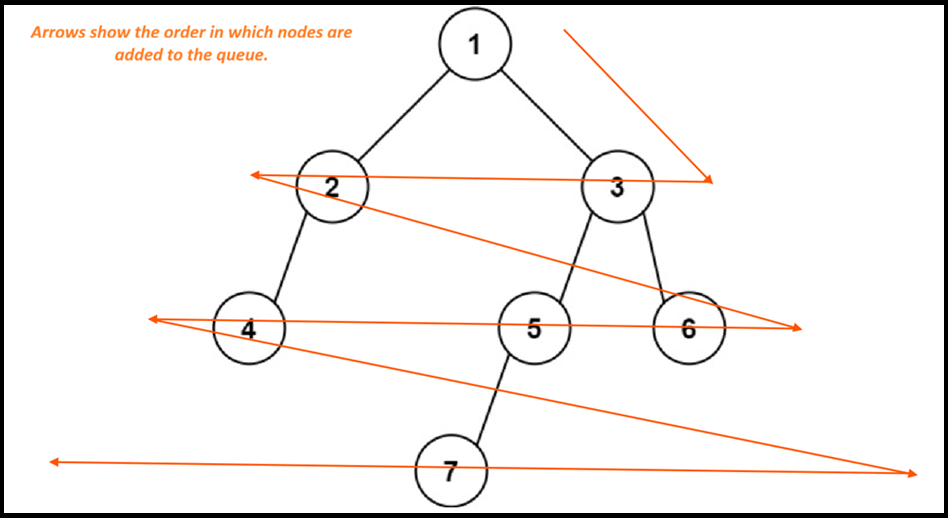

**Time Complexity:** *O(n),* **Space Complexity:** *O(n).*

**Explanation**


```cpp
/**
 * Definition for a binary tree node.
 * struct TreeNode {
 *     int val;
 *     TreeNode *left;
 *     TreeNode *right;
 *     TreeNode() : val(0), left(nullptr), right(nullptr) {}
 *     TreeNode(int x) : val(x), left(nullptr), right(nullptr) {}
 *     TreeNode(int x, TreeNode *left, TreeNode *right) : val(x), left(left), right(right) {}
 * };
 */
class Solution {
public:
    int findBottomLeftValue(TreeNode* root) {
        TreeNode *node;
        queue<TreeNode *> _queue;
        int result=0;
        _queue.push(root);
        while(_queue.empty()==false) {
            node=_queue.front();
            _queue.pop();
            result=node->val;
            if(node->right) _queue.push(node->right);
            if(node->left) _queue.push(node->left);
        }
        return result;
    }
};
```